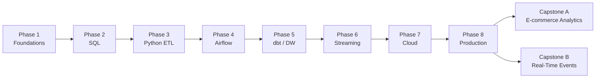

# Data Engineering Roadmap: Beginner → Pro

This roadmap takes you from zero to job-ready. Every phase ends with a **mini-project** you can add to your portfolio. Two **capstones** at the end prove you can build production-style systems.

---

## Phase Overview

| Phase | Theme | You will learn | Phase project |
|-------|-------|----------------|---------------|
| **1** | [Foundations](curriculum/phase-01-foundations/README.md) | DE role, data lifecycle, formats, local tooling | Build a local CSV → clean → report pipeline |
| **2** | [SQL & Data Modeling](curriculum/phase-02-sql-data-modeling/README.md) | SQL depth, normalization, star/snowflake schemas | Design & load a dimensional model |
| **3** | [Python Pipelines](curriculum/phase-03-python-data-pipelines/README.md) | pandas, file I/O, APIs, error handling | Batch ETL: ingest → transform → load |
| **4** | [Orchestration](curriculum/phase-04-etl-orchestration/README.md) | Airflow concepts, DAGs, scheduling, retries | Schedule & monitor a daily pipeline |
| **5** | [Data Warehousing](curriculum/phase-05-data-warehousing/README.md) | OLTP vs OLAP, dbt, incremental models | dbt project with tests & documentation |
| **6** | [Streaming](curriculum/phase-06-streaming-real-time/README.md) | Events, Kafka basics, stream vs batch | Real-time clickstream aggregator |
| **7** | [Cloud DE](curriculum/phase-07-cloud-data-engineering/README.md) | Object storage, managed warehouses, IAM | Cloud-native batch pipeline (local simulation) |
| **8** | [Production & Pro](curriculum/phase-08-production-best-practices/README.md) | Observability, data contracts, CI/CD for DE | Harden a pipeline with tests & alerts |

---

## Skill Progression

---

## What "Pro" Means Here

By the end you should be able to:

- Design a dimensional data model and defend your grain choices
- Build batch and streaming pipelines in Python
- Orchestrate workflows with Airflow (or equivalent)
- Transform data in a warehouse with dbt, including tests
- Explain trade-offs: batch vs stream, SQL vs Spark, cloud services
- Add monitoring, data quality checks, and documentation to a pipeline
- Walk through two portfolio projects in a technical interview

---

## Time Estimates (per phase)

| Phase | Lessons | Exercises | Project | Total |
|-------|---------|-----------|---------|-------|
| 1 | 3–4 hrs | 2–3 hrs | 4–6 hrs | ~1–2 weeks |
| 2 | 4–5 hrs | 4–6 hrs | 6–8 hrs | ~2 weeks |
| 3 | 4–5 hrs | 4–6 hrs | 8–10 hrs | ~2 weeks |
| 4 | 3–4 hrs | 3–4 hrs | 8–10 hrs | ~2 weeks |
| 5 | 4–5 hrs | 4–5 hrs | 10–12 hrs | ~2–3 weeks |
| 6 | 3–4 hrs | 3–4 hrs | 8–10 hrs | ~2 weeks |
| 7 | 4–5 hrs | 3–4 hrs | 8–10 hrs | ~2 weeks |
| 8 | 3–4 hrs | 3–4 hrs | 10–12 hrs | ~2 weeks |
| Capstones | — | — | 40–60 hrs each | 4–6 weeks |

---

## Prerequisites

- Basic computer literacy (files, folders, terminal)
- Willingness to use Python and SQL (taught from scratch in context)
- No prior data engineering experience required

Optional but helpful: any exposure to Excel, basic programming, or databases.

---

## Tools You'll Use

| Tool | Phases | Notes |
|------|--------|-------|
| Python 3.11+ | All | Core language |
| SQLite / DuckDB | 1–3, 5 | Local SQL practice |
| pandas | 1–4, 7 | Data manipulation |
| Apache Airflow | 4 | Orchestration (Docker) |
| dbt + DuckDB | 5 | Transformations |
| Docker | 4, 6 | Airflow, Kafka locally |
| Kafka (local) | 6 | Streaming |
| Git | All | Version control |

Setup guide: [docs/SETUP.md](docs/SETUP.md)
