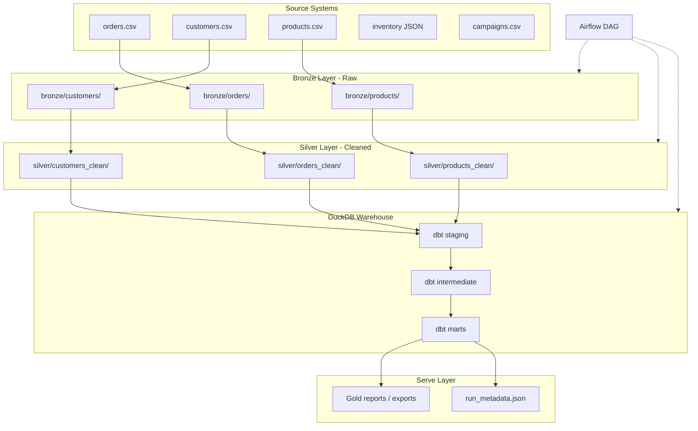

# Capstone A: E-Commerce Analytics Platform

**Duration:** 4–6 weeks (40–60 hours)  
**Prerequisites:** Complete Phases 1–8 of the curriculum  
**Deliverable:** A portfolio-ready batch analytics platform with orchestration, dimensional modeling, dbt transformations, and production hardening

---

## Executive Summary

You are the founding data engineer at **ShopStream**, a mid-size e-commerce company. Leadership wants a unified analytics platform that replaces ad-hoc CSV exports and spreadsheet reports. Your job is to design and build an end-to-end **batch analytics pipeline** — from raw operational data to tested, documented metrics that finance, marketing, and product teams can trust.

This capstone synthesizes everything from the curriculum: local ETL foundations, SQL dimensional modeling, Python batch pipelines, Airflow orchestration, dbt warehouse transformations, cloud storage patterns, and production best practices. You will **not** build a streaming layer here (that's Capstone B); instead you will deliver a production-grade batch system that could later feed real-time dashboards.

---

## Business Context

### Stakeholders & Questions

| Team | Key questions your platform must answer |
|------|----------------------------------------|
| **Finance** | What is daily/monthly revenue? Refund rate? Average order value by category? |
| **Marketing** | Which customer segments drive the most revenue? Cohort retention by signup month? |
| **Product** | Top products by units sold? Category mix over time? Cart abandonment proxy (cancelled orders)? |
| **Operations** | Pipeline health: did today's load succeed? Row counts vs yesterday? Data freshness? |

### Source Systems (Simulated)

You will work with the curriculum datasets plus generated supplementary data:

| Source | Format | Grain | Update pattern |
|--------|--------|-------|----------------|
| `orders` | CSV / Parquet | One row per order line | Daily incremental |
| `customers` | CSV | One row per customer | Slowly changing (SCD Type 2 optional stretch) |
| `products` | CSV | One row per SKU | Full refresh weekly |
| `inventory_snapshots` | JSON (you generate) | One row per product per day | Daily append |
| `marketing_campaigns` | CSV (you generate) | One row per campaign | Full refresh |

All base files live in `shared/datasets/`. You will extend them with realistic synthetic data as needed.

---

## Curriculum Skills Map

This capstone explicitly exercises skills from **all 8 phases**:

| Phase | Skills applied in this capstone |
|-------|--------------------------------|
| **[Phase 1: Foundations](../../curriculum/phase-01-foundations/README.md)** | Data lifecycle (ingest → transform → serve), file formats (CSV, Parquet, JSON), medallion layering (bronze/silver/gold), run metadata |
| **[Phase 2: SQL & Data Modeling](../../curriculum/phase-02-sql-data-modeling/README.md)** | Star schema design, grain definition, fact/dimension tables, surrogate keys, conformed dimensions |
| **[Phase 3: Python Pipelines](../../curriculum/phase-03-python-data-pipelines/README.md)** | Multi-source ingestion, validation, idempotent loads, error handling, structured logging |
| **[Phase 4: Orchestration](../../curriculum/phase-04-etl-orchestration/README.md)** | Airflow DAGs, task dependencies, scheduling, retries, sensors, backfill strategy |
| **[Phase 5: Data Warehousing](../../curriculum/phase-05-data-warehousing/README.md)** | dbt staging → intermediate → mart models, incremental models, tests, documentation |
| **[Phase 6: Streaming](../../curriculum/phase-06-streaming-real-time/README.md)** | *Conceptual only:* articulate where batch ends and streaming would begin; design event contracts for future clickstream integration |
| **[Phase 7: Cloud DE](../../curriculum/phase-07-cloud-data-engineering/README.md)** | Partitioned object storage layout (`year=/month=/day=`), local S3 simulation, cost-aware partitioning |
| **[Phase 8: Production](../../curriculum/phase-08-production-best-practices/README.md)** | Data quality checks, observability, data contracts, CI/CD for dbt, alerting on pipeline failure |

---

## Tech Stack

| Layer | Tool | Why |
|-------|------|-----|
| **Language** | Python 3.11+ | Ingestion, validation, orchestration glue |
| **Local SQL** | DuckDB | Warehouse for analytics (dbt target) |
| **Transformations** | dbt + dbt-duckdb | Versioned SQL, tests, docs |
| **Orchestration** | Apache Airflow (Docker) | Schedule daily pipeline, manage dependencies |
| **Storage** | Local filesystem (S3-style paths) | Bronze/silver/gold zones |
| **Data quality** | dbt tests + Great Expectations (optional) | Schema and business rule validation |
| **Version control** | Git | Track all code and dbt models |
| **CI** | GitHub Actions (optional stretch) | Run dbt test on PR |

---

## Architecture



### Medallion Layers

| Layer | Purpose | Format | Partitioning |
|-------|---------|--------|--------------|
| **Bronze** | Immutable raw ingest | Parquet (preserve source schema) | `source/year=YYYY/month=MM/day=DD/` |
| **Silver** | Cleaned, typed, deduplicated | Parquet | `entity/year=YYYY/month=MM/day=DD/` |
| **Gold (dbt marts)** | Business-ready dimensional model | DuckDB tables | N/A (warehouse-managed) |

---

## Suggested Folder Structure

Create this structure under `capstones/capstone-01-ecommerce-analytics/`:

```
capstone-01-ecommerce-analytics/
├── README.md                    # This file
├── MILESTONES.md                # Week-by-week plan
├── CHECKLIST.md                 # Acceptance criteria tracker
├── docs/
│   ├── architecture.md          # Your design doc (you write)
│   ├── data-dictionary.md       # Column definitions for all tables
│   └── decisions.md             # ADRs: grain choices, incremental strategy
├── ingestion/
│   ├── __init__.py
│   ├── extractors/
│   │   ├── orders.py
│   │   ├── customers.py
│   │   └── products.py
│   ├── validators/
│   │   └── schemas.py           # Data contract definitions
│   └── loaders/
│       └── bronze_writer.py     # Partitioned Parquet writes
├── transforms/
│   ├── __init__.py
│   ├── clean_orders.py
│   ├── clean_customers.py
│   └── clean_products.py
├── orchestration/
│   ├── docker-compose.yml       # Airflow services
│   ├── dags/
│   │   └── shopstream_daily.py  # Main DAG
│   └── plugins/                 # Optional custom operators
├── dbt_shopstream/
│   ├── dbt_project.yml
│   ├── profiles.yml
│   ├── models/
│   │   ├── staging/
│   │   │   ├── stg_orders.sql
│   │   │   ├── stg_customers.sql
│   │   │   └── stg_products.sql
│   │   ├── intermediate/
│   │   │   └── int_order_lines_enriched.sql
│   │   └── marts/
│   │       ├── core/
│   │       │   ├── fct_orders.sql
│   │       │   ├── dim_customers.sql
│   │       │   ├── dim_products.sql
│   │       │   └── dim_dates.sql
│   │       └── metrics/
│   │           ├── mart_daily_revenue.sql
│   │           ├── mart_category_performance.sql
│   │           └── mart_customer_cohorts.sql
│   ├── tests/
│   │   └── assert_positive_revenue.sql
│   └── seeds/
│       └── dim_dates.csv
├── storage/                     # gitignored — local data lake
│   ├── bronze/
│   ├── silver/
│   └── gold/
├── scripts/
│   ├── run_pipeline.sh          # One-command local run
│   ├── generate_sample_data.py  # Synthetic inventory/campaigns
│   └── backfill.py              # Historical load utility
├── tests/
│   ├── test_clean_orders.py
│   └── test_validators.py
├── .github/
│   └── workflows/
│       └── dbt_ci.yml           # Optional: dbt test on push
└── reports/
    └── sample_queries.sql       # Stakeholder-facing SQL examples
```

---

## Dimensional Model Requirements

Design a **star schema** with clearly documented grain:

### Fact Tables

| Table | Grain | Measures |
|-------|-------|----------|
| `fct_orders` | One row per order line | `quantity`, `unit_price`, `line_revenue`, `discount_amount` |
| `fct_inventory_daily` (stretch) | One row per product per day | `units_on_hand`, `days_of_supply` |

### Dimension Tables

| Table | Type | Key attributes |
|-------|------|----------------|
| `dim_customers` | SCD Type 1 (Type 2 stretch) | `customer_id`, `segment`, `signup_date`, `country` |
| `dim_products` | SCD Type 1 | `product_id`, `name`, `category`, `subcategory`, `unit_cost` |
| `dim_dates` | Role-playing | Standard date dimension with `fiscal_month`, `is_weekend` |
| `dim_campaigns` (stretch) | SCD Type 1 | `campaign_id`, `channel`, `start_date`, `budget` |

### Business Rules (Must Implement)

1. **Cancelled orders** — exclude from revenue metrics; track separately in a `orders_cancelled_count` metric
2. **Refunded orders** — negative `line_revenue` in fact table; include in net revenue calculations
3. **Currency** — assume single currency (USD); document if you add multi-currency stretch
4. **Late-arriving data** — orders may arrive up to 3 days late; incremental model must handle updates
5. **Surrogate keys** — `customer_key`, `product_key`, `date_key` in fact table (not natural IDs alone)

---

## Multi-Week Plan

See [MILESTONES.md](MILESTONES.md) for the detailed week-by-week breakdown. Summary:

| Week | Focus | Exit criteria |
|------|-------|---------------|
| **1** | Architecture & bronze ingest | Partitioned raw data landing daily |
| **2** | Silver transforms & data contracts | Cleaned Parquet with validation |
| **3** | Dimensional model & dbt staging | Star schema in DuckDB |
| **4** | dbt marts, tests, docs | Business metrics queryable with tests passing |
| **5** | Airflow orchestration | Scheduled DAG with retries and alerting |
| **6** | Production hardening & portfolio | CI, README, demo-ready walkthrough |

---

## Acceptance Criteria

Use [CHECKLIST.md](CHECKLIST.md) to track completion. High-level gates:

### Functional
- [ ] Daily pipeline ingests all source files into partitioned bronze layer
- [ ] Silver layer applies cleaning rules (cancelled/refund handling, type coercion, dedup)
- [ ] dbt project builds staging → marts without errors
- [ ] At least 3 mart models answer stakeholder questions from the table above
- [ ] Incremental load works for orders (only new/changed rows processed)

### Data Quality
- [ ] dbt tests: `not_null`, `unique`, `relationships` on key columns
- [ ] Custom test: revenue is non-negative for non-refund rows
- [ ] Data contract documented for each source (schema + freshness SLA)
- [ ] Row count reconciliation: bronze vs silver vs staging (within expected bounds)

### Operations
- [ ] Airflow DAG runs end-to-end on schedule (or manual trigger)
- [ ] Failed tasks retry with backoff; final failure sends log alert
- [ ] `run_metadata.json` captures run timestamp, row counts, duration, status
- [ ] Backfill script can reload a date range idempotently

### Documentation
- [ ] Architecture diagram and data dictionary committed
- [ ] dbt docs generated (`dbt docs generate && dbt docs serve`)
- [ ] README with setup, run instructions, and sample query output

---

## Getting Started

### 1. Prerequisites check

```bash
python shared/utils/verify_setup.py
docker --version   # Required for Airflow
dbt --version      # Installed in Phase 5
```

### 2. Scaffold your project

```bash
cd capstones/capstone-01-ecommerce-analytics
mkdir -p ingestion/extractors ingestion/validators ingestion/loaders
mkdir -p transforms orchestration/dags dbt_shopstream/models/{staging,intermediate,marts/core,marts/metrics}
mkdir -p storage/{bronze,silver,gold} tests docs scripts reports
```

### 3. Start with Milestone 1

Open [MILESTONES.md](MILESTONES.md) and begin Week 1. Do **not** skip the architecture doc — grain mistakes are expensive to fix later.

### 4. Reuse phase project code

| Phase project | Reuse for |
|---------------|-----------|
| [Phase 1: Local CSV Pipeline](../../curriculum/phase-01-foundations/project/README.md) | `transforms.py` cleaning logic |
| [Phase 2: Star Schema Mini-Mart](../../curriculum/phase-02-sql-data-modeling/project/README.md) | Dimensional model design |
| [Phase 3: Batch ETL Pipeline](../../curriculum/phase-03-python-data-pipelines/project/README.md) | Multi-source ingestion patterns |
| [Phase 4: Scheduled Daily Pipeline](../../curriculum/phase-04-etl-orchestration/project/README.md) | Airflow DAG structure |
| [Phase 5: dbt Analytics Project](../../curriculum/phase-05-data-warehousing/project/README.md) | dbt project scaffold |
| [Phase 7: Cloud-Native Batch Load](../../curriculum/phase-07-cloud-data-engineering/project/README.md) | Partitioned write patterns |
| [Phase 8: Production-Ready Pipeline](../../curriculum/phase-08-production-best-practices/project/README.md) | Quality checks, logging, CI |

---

## Stretch Goals

Pick one or two if you finish early:

- **SCD Type 2** for `dim_customers` (track segment changes over time)
- **Great Expectations** suite running before silver writes
- **GitHub Actions** CI that runs `dbt test` on every PR
- **Metabase or Evidence** connected to DuckDB for a live dashboard
- **Slowly changing product catalog** with effective-dated `dim_products`
- **Data lineage diagram** using dbt docs or manual Mermaid

---

## Interview Talking Points

Prepare to discuss these in a 15-minute technical walkthrough:

### Architecture & Design
- **Why star schema over normalized?** OLAP query patterns, join performance, business user comprehension
- **How did you choose grain for `fct_orders`?** Order line vs order header trade-off; impact on revenue double-counting
- **Bronze vs silver vs gold:** What lives where and why? Immutability, reprocessing, schema evolution
- **Batch vs streaming:** Where would you add Kafka for clickstream? What stays batch (financial close, inventory)?

### Technical Depth
- **Incremental model strategy:** Merge vs delete+insert; handling late-arriving orders
- **Idempotency:** What happens if the DAG runs twice for the same date? How do you prevent duplicates?
- **Airflow design:** Task granularity, sensor vs trigger, backfill without breaking downstream
- **dbt testing philosophy:** Which tests caught real bugs? Custom tests vs generic

### Production & Trade-offs
- **Data contracts:** What happens when upstream changes a column? Detection and escalation path
- **Failure modes:** Bronze ingest fails vs dbt test fails — different alerting and recovery
- **Cost awareness:** Partition pruning, columnar formats, avoiding full-table scans
- **What you'd do differently at 10x scale:** Spark vs DuckDB, Snowflake, event-driven ingestion

### Behavioral
- **Stakeholder conflict:** Finance wants gross revenue; product wants net — how did you document definitions?
- **Timeline pressure:** What did you cut vs what is non-negotiable for production?
- **Something that broke:** Walk through a real bug and how you diagnosed it (row count mismatch, grain issue, etc.)

### Sample 30-Second Elevator Pitch

> "I built an end-to-end e-commerce analytics platform for ShopStream. Raw CSV and JSON land in a partitioned bronze layer, get validated and cleaned into silver Parquet, then flow into a DuckDB warehouse via dbt staging and mart models. Airflow orchestrates the daily run with retries and metadata logging. The star schema supports finance revenue reporting, marketing cohort analysis, and product category metrics — all tested with dbt and documented for stakeholders."

---

## Resources

- [Curriculum Glossary](../../docs/GLOSSARY.md)
- [Setup Guide](../../docs/SETUP.md)
- [Progress Tracker](../../PROGRESS.md)
- [Capstone B: Real-Time Events](../capstone-02-real-time-events/README.md) — complementary streaming project

---

**Next step:** Open [MILESTONES.md](MILESTONES.md) and start Week 1.
