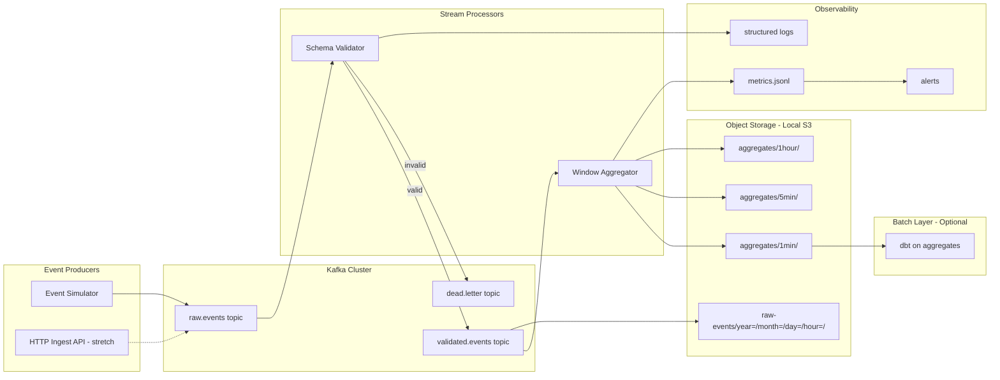

# Capstone B: Real-Time Event Pipeline

**Duration:** 4–6 weeks (40–60 hours)  
**Prerequisites:** Complete Phases 1–8 of the curriculum  
**Deliverable:** A portfolio-ready streaming pipeline with Kafka, windowed aggregations, cloud storage sinks, and production monitoring

---

## Executive Summary

You are the streaming data engineer at **EventPulse**, a digital platform that tracks user behavior across web and mobile. Product and growth teams need **near-real-time metrics** — active users, page views per minute, conversion funnels — not tomorrow's batch report. Your job is to design and build an end-to-end **event streaming pipeline** that ingests clickstream events, aggregates them in motion, lands results in object storage, and surfaces health metrics for operators.

This capstone synthesizes streaming skills from Phase 6, cloud storage patterns from Phase 7, and production observability from Phase 8. It complements [Capstone A](../capstone-01-ecommerce-analytics/README.md) (batch analytics) — together they demonstrate you can build both sides of a modern data platform.

---

## Business Context

### Stakeholders & Questions

| Team | Key questions your pipeline must answer |
|------|----------------------------------------|
| **Product** | How many users are active right now? Top pages in the last 5 minutes? |
| **Growth** | Click-through rate by campaign in the last hour? Signup funnel drop-off? |
| **Engineering** | Is the pipeline healthy? Consumer lag? Event schema violations? |
| **Data Platform** | Can we replay events? Are aggregates idempotent? Storage costs under control? |

### Event Types

Your pipeline processes these clickstream events (JSON):

| Event | Key fields | Business use |
|-------|------------|--------------|
| `page_view` | `user_id`, `session_id`, `page_url`, `timestamp` | Traffic monitoring |
| `click` | `user_id`, `session_id`, `element_id`, `page_url`, `timestamp` | Engagement tracking |
| `signup` | `user_id`, `email_hash`, `source`, `timestamp` | Conversion funnel |
| `purchase` | `user_id`, `order_id`, `amount`, `timestamp` | Revenue (streaming complement to batch) |

### Volume Assumptions (Local Simulation)

| Metric | Value |
|--------|-------|
| Peak events/sec | 50–200 (simulated) |
| Avg event size | ~500 bytes JSON |
| Retention (raw) | 7 days in storage |
| Aggregation windows | 1-minute, 5-minute, 1-hour tumbling |

---

## Curriculum Skills Map

This capstone explicitly exercises skills from **all 8 phases**:

| Phase | Skills applied in this capstone |
|-------|--------------------------------|
| **[Phase 1: Foundations](../../curriculum/phase-01-foundations/README.md)** | Data lifecycle (stream path), JSON event format, metadata logging, local dev workflow |
| **[Phase 2: SQL & Data Modeling](../../curriculum/phase-02-sql-data-modeling/README.md)** | Aggregation grain (per window per page), denormalized event schemas, query patterns on landed Parquet |
| **[Phase 3: Python Pipelines](../../curriculum/phase-03-python-data-pipelines/README.md)** | Event producers, consumers, error handling, idempotent writes to storage |
| **[Phase 4: Orchestration](../../curriculum/phase-04-etl-orchestration/README.md)** | Consumer process supervision, restart policies, dependency between producer/consumer deploys |
| **[Phase 5: Data Warehousing](../../curriculum/phase-05-data-warehousing/README.md)** | Downstream dbt models on landed aggregates (batch layer on stream output); late-data handling |
| **[Phase 6: Streaming](../../curriculum/phase-06-streaming-real-time/README.md)** | Kafka topics, partitions, producers, consumers, windowed aggregations, at-least-once delivery |
| **[Phase 7: Cloud DE](../../curriculum/phase-07-cloud-data-engineering/README.md)** | Object storage sink layout, partitioned writes by date/hour, compaction, retention policies |
| **[Phase 8: Production](../../curriculum/phase-08-production-best-practices/README.md)** | Schema validation, consumer lag monitoring, structured logging, alerting, data contracts |

---

## Tech Stack

| Layer | Tool | Why |
|-------|------|-----|
| **Message broker** | Apache Kafka (Docker) | Industry-standard event streaming |
| **Language** | Python 3.11+ | Producers, consumers, aggregators |
| **Kafka client** | `confluent-kafka` or `kafka-python` | Produce/consume events |
| **Aggregation** | Python (custom) or Faust (stretch) | Windowed counts and sums |
| **Storage sink** | Local filesystem (S3-style paths) | Aggregates + raw event archive |
| **Query layer** | DuckDB | SQL on landed Parquet |
| **Monitoring** | Prometheus-style metrics (JSON logs) + optional Grafana | Lag, throughput, error rate |
| **Schema** | JSON Schema or Pydantic models | Event validation |
| **Orchestration** | Docker Compose | Kafka, Zookeeper, consumers |
| **Version control** | Git | All code and configs |

---

## Architecture



### Data Flow Summary

1. **Produce** — Event simulator (or API) publishes JSON to `raw.events`
2. **Validate** — Schema validator checks required fields, types, timestamps; routes invalid events to `dead.letter`
3. **Aggregate** — Windowed aggregator computes counts (page views, unique users, clicks) per tumbling window
4. **Sink** — Validated events → raw archive; aggregates → partitioned Parquet
5. **Monitor** — Metrics exporter logs throughput, lag, error rate every 30 seconds
6. **Query** — DuckDB SQL on landed Parquet for ad-hoc analysis and dbt models (optional)

---

## Suggested Folder Structure

Create this structure under `capstones/capstone-02-real-time-events/`:

```
capstone-02-real-time-events/
├── README.md                    # This file
├── MILESTONES.md                # Week-by-week plan
├── CHECKLIST.md                 # Acceptance criteria tracker
├── docs/
│   ├── architecture.md          # Your design doc
│   ├── event-catalog.md         # Event schemas and examples
│   ├── sla.md                   # Latency, freshness, availability targets
│   └── decisions.md             # ADRs: delivery semantics, partition strategy
├── docker/
│   ├── docker-compose.yml       # Kafka, Zookeeper, (optional) Kafka UI
│   └── kafka/
│       └── create-topics.sh     # Topic creation with partition counts
├── schemas/
│   ├── page_view.json           # JSON Schema per event type
│   ├── click.json
│   ├── signup.json
│   ├── purchase.json
│   └── registry.py              # Pydantic models (alternative to JSON Schema)
├── producers/
│   ├── __init__.py
│   ├── event_simulator.py       # Generates realistic clickstream at configurable rate
│   ├── simulator_config.yaml    # Rates, user pools, page catalog
│   └── http_ingest.py           # Stretch: Flask/FastAPI ingest endpoint
├── consumers/
│   ├── __init__.py
│   ├── base_consumer.py         # Shared Kafka consumer setup
│   ├── schema_validator.py      # Validate + route to dead letter
│   ├── window_aggregator.py     # Tumbling window aggregations
│   └── raw_archiver.py          # Write validated events to storage
├── sinks/
│   ├── __init__.py
│   ├── parquet_writer.py        # Partitioned Parquet writes
│   └── path_builder.py          # S3-style path construction
├── monitoring/
│   ├── __init__.py
│   ├── metrics.py               # Counters: events_in, events_out, errors, lag
│   ├── health_check.py          # Endpoint or script for pipeline health
│   └── alerts.py                # Threshold-based alert rules
├── queries/
│   ├── realtime_dashboard.sql   # Last-5-min metrics
│   └── daily_rollup.sql         # Batch query on landed aggregates
├── dbt_eventpulse/              # Optional: batch layer on aggregates
│   ├── dbt_project.yml
│   └── models/
│       └── marts/
│           └── mart_hourly_traffic.sql
├── storage/                     # gitignored
│   ├── raw-events/
│   ├── aggregates/
│   └── dead-letter/
├── tests/
│   ├── test_schemas.py
│   ├── test_aggregator.py
│   └── test_path_builder.py
├── scripts/
│   ├── start_pipeline.sh        # Docker up + consumers
│   ├── stop_pipeline.sh
│   ├── produce_burst.py         # Inject traffic spike for testing
│   └── replay_events.py         # Reprocess from raw archive
└── logs/                        # gitignored
    └── metrics.jsonl
```

---

## Kafka Topic Design

| Topic | Partitions | Retention | Purpose |
|-------|------------|-----------|---------|
| `raw.events` | 6 | 24 hours | Ingestion entry point |
| `validated.events` | 6 | 48 hours | Schema-valid events for processing |
| `dead.letter` | 3 | 7 days | Invalid events for debugging |
| `aggregates.1min` | 3 | 24 hours | Optional: re-publish aggregates for downstream |

### Partition Key Strategy

- **Key:** `user_id` (keeps per-user event order within a partition)
- **Alternative:** `session_id` if session-ordering matters more
- Document your choice in `docs/decisions.md`

### Delivery Semantics

Target: **at-least-once** processing with **idempotent sinks**.

- Consumers commit offsets after successful write to storage
- Sink writes use deterministic filenames: `{window_start}_{partition}_{aggregation_type}.parquet`
- Reprocessing same events overwrites same file (idempotent)

---

## Aggregation Requirements

### 1-Minute Tumbling Windows

| Metric | Grain | Calculation |
|--------|-------|-------------|
| `page_views` | per `page_url` | COUNT of `page_view` events |
| `unique_users` | per `page_url` | COUNT DISTINCT `user_id` |
| `clicks` | per `page_url` | COUNT of `click` events |
| `signups` | global | COUNT of `signup` events |
| `revenue` | global | SUM of `purchase.amount` |

### 5-Minute and 1-Hour Windows

Same metrics at coarser grains for trend analysis. Implement by:
- **Option A:** Separate tumbling windows in aggregator (recommended)
- **Option B:** Roll up 1-minute aggregates (document trade-off: faster but less accurate for distinct counts)

### Window Boundaries

- Align to wall-clock: `[10:00:00, 10:01:00)`, `[10:01:00, 10:02:00)`, etc.
- Late events (> 30 seconds after window close) → log to `late_events` counter, optionally route to side output

---

## Multi-Week Plan

See [MILESTONES.md](MILESTONES.md) for the detailed week-by-week breakdown. Summary:

| Week | Focus | Exit criteria |
|------|-------|---------------|
| **1** | Kafka setup & event production | Events flowing to `raw.events` |
| **2** | Schema validation & dead letter | Invalid events quarantined |
| **3** | Windowed aggregations | 1-min metrics computed and written |
| **4** | Storage sinks & partitioning | Parquet landed with correct paths |
| **5** | Monitoring & alerting | Lag, throughput, errors visible |
| **6** | Production hardening & portfolio | Replay, docs, demo-ready |

---

## Acceptance Criteria

Use [CHECKLIST.md](CHECKLIST.md) to track completion. High-level gates:

### Functional
- [ ] Event simulator produces ≥ 50 events/sec sustained for 5 minutes
- [ ] Schema validator routes invalid events to `dead.letter` without crashing
- [ ] 1-minute, 5-minute, and 1-hour aggregates land in partitioned Parquet
- [ ] Raw validated events archived to `storage/raw-events/`
- [ ] DuckDB query returns correct page view count for a known test window

### Reliability
- [ ] Consumer restart resumes from last committed offset (no mass duplicate on normal restart)
- [ ] Sink writes are idempotent (re-run produces same files)
- [ ] Dead letter topic retains invalid events with rejection reason
- [ ] `scripts/replay_events.py` can reprocess a date range from raw archive

### Observability
- [ ] Metrics logged: `events_consumed`, `events_produced`, `validation_errors`, `consumer_lag`, `window_close_latency_ms`
- [ ] Alert fires when consumer lag exceeds threshold (tested with `produce_burst.py`)
- [ ] Structured JSON logs with `trace_id` or `event_id` for debugging
- [ ] Health check script returns pass/fail status

### Documentation
- [ ] Event catalog with JSON examples for all 4 event types
- [ ] Architecture doc with delivery semantics and partition strategy
- [ ] README with setup, start/stop, and sample query output

---

## Getting Started

### 1. Prerequisites check

```bash
python shared/utils/verify_setup.py
docker --version   # Required for Kafka
pip show confluent-kafka  # or kafka-python
```

### 2. Scaffold your project

```bash
cd capstones/capstone-02-real-time-events
mkdir -p docker/kafka schemas producers consumers sinks monitoring queries tests scripts docs storage
```

### 3. Start Kafka

```bash
cd docker
docker compose up -d
./kafka/create-topics.sh
```

### 4. Start with Milestone 1

Open [MILESTONES.md](MILESTONES.md) and begin Week 1.

### 5. Reuse phase project code

| Phase project | Reuse for |
|---------------|-----------|
| [Phase 3: Batch ETL Pipeline](../../curriculum/phase-03-python-data-pipelines/project/README.md) | Error handling, logging patterns |
| [Phase 4: Scheduled Daily Pipeline](../../curriculum/phase-04-etl-orchestration/project/README.md) | Process supervision concepts |
| [Phase 5: dbt Analytics Project](../../curriculum/phase-05-data-warehousing/project/README.md) | Optional batch layer on aggregates |
| [Phase 6: Clickstream Aggregator](../../curriculum/phase-06-streaming-real-time/project/README.md) | Core Kafka producer/consumer patterns |
| [Phase 7: Cloud-Native Batch Load](../../curriculum/phase-07-cloud-data-engineering/project/README.md) | Partitioned Parquet write patterns |
| [Phase 8: Production-Ready Pipeline](../../curriculum/phase-08-production-best-practices/project/README.md) | Data contracts, monitoring, alerting |

---

## Stretch Goals

- **Faust or Spark Structured Streaming** instead of custom Python aggregator
- **HTTP ingest API** (`producers/http_ingest.py`) accepting POST events
- **Kafka UI** (Provectus) in Docker Compose for topic inspection
- **Grafana dashboard** reading from `metrics.jsonl`
- **dbt mart** on hourly aggregates with incremental load
- **Exactly-once semantics** with Kafka transactions (document complexity trade-off)
- **Integration with Capstone A** — `purchase` events feed ShopStream's order pipeline

---

## Interview Talking Points

Prepare to discuss these in a 15-minute technical walkthrough:

### Architecture & Design
- **Why Kafka?** Decoupling producers/consumers, replay, multiple subscribers, industry standard
- **Topic partition strategy:** Why `user_id` as key? Hot partition risk? How many partitions?
- **Window type choice:** Tumbling vs sliding vs session windows for clickstream
- **Batch vs stream:** What metrics need real-time vs what can wait for daily batch (Capstone A)?

### Technical Depth
- **Delivery semantics:** At-least-once vs exactly-once; how idempotent sinks compensate
- **Late-arriving events:** Watermark strategy, allowed lateness, impact on window accuracy
- **Distinct count in distributed windows:** HyperLogLog vs exact count trade-off
- **Consumer lag:** What causes it, how you monitor, how you scale (add partitions vs consumers)

### Production & Trade-offs
- **Schema evolution:** Adding a field to `page_view` — backward compatible? Migration plan?
- **Dead letter queue:** When do you replay vs discard? Alerting on DLQ growth
- **Storage cost:** Raw event retention vs aggregate-only; compaction strategy
- **Failure modes:** Broker down, consumer crash mid-window, disk full on sink

### Behavioral
- **Latency vs correctness:** Did you favor faster approximate counts or slower exact counts?
- **Operational runbook:** What do you do at 3 AM when lag spikes?
- **Cross-capstone story:** How EventPulse streaming complements ShopStream batch analytics

### Sample 30-Second Elevator Pitch

> "I built a real-time clickstream pipeline for EventPulse. A Python event simulator publishes JSON to Kafka; a schema validator quarantines bad events to a dead-letter topic; a windowed aggregator computes page views, unique users, and revenue across 1-minute, 5-minute, and 1-hour tumbling windows. Results land in partitioned Parquet with S3-style paths, and a metrics exporter tracks consumer lag, throughput, and error rates with threshold alerts. The design is at-least-once with idempotent sinks, so restarts and replays are safe."

---

## Resources

- [Curriculum Glossary](../../docs/GLOSSARY.md) — streaming terms
- [Setup Guide](../../docs/SETUP.md) — Docker requirements
- [Progress Tracker](../../PROGRESS.md)
- [Capstone A: E-Commerce Analytics](../capstone-01-ecommerce-analytics/README.md) — complementary batch project

---

**Next step:** Open [MILESTONES.md](MILESTONES.md) and start Week 1.
